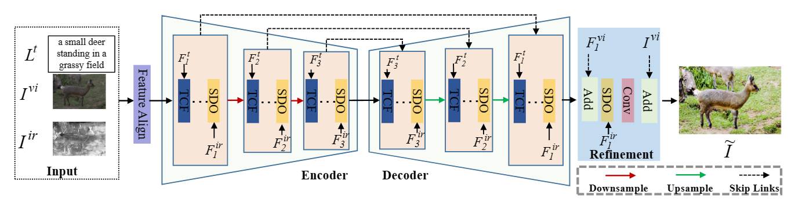

# TITFormer: Combining Text and Simulating Infrared Modalities Based on Transformer for Image Enhancement
PyTorch implementation for TITFormer: Combining Text and Simulating Infrared Modalities Based on Transformer for Image Enhancement
## Introduction
The image enhancement task requires a complex balance between extracting high-level contextual information and optimizing spatial details in the image to improve the visual quality. Most of existing methods have limited capability in capturing contextual features and optimizing spatial details when they only rely on a single modality. To address the above issues, this paper introduces a novel multi-modal image enhancement network based on Transformer, named as TITFormer, which combines textual and simulating infrared modalities firstly for this important task. TITFormer comprises a text channel attention fusion (TCF) network block and an infrared-guided spatial detail optimization (SDO)  network block. The TCF extracts contextual features from the high-dimensional features compressed after spatial channel transformation of the text modality and original image. The SDO module uses simulating infrared images characterized by pixel intensity to guide the optimization of spatial details with contextual features adaptively. Experimental results demonstrate that TITFormer achieves state-of-the-art performance on two publicly available benchmark datasets. Our code will be released after the review.

<p align="center">
  
</p>

## Code Structure

- `bert-base-uncased/`: bert pretrained_model.
- `option/`: including configurations to conduct experiments.
- `data/`: dataset path.
- `dataset.py`: the dataset class for image enhancement (FiveK and PPR10K).
- `model.py`: the implementation of TITFormer model.
- `trainppr.py`: a python script to run a train PPR10K.
- `trainrgb.py`: a python script to run a train FiveK.

## Dependencies

* Python 3.7.0
* PyTorch 1.11.0+cu113
### Installation
You can set up the Envirment with conda and pip as follows:
```shell
conda create -n titformer python=3.7
conda activate titformer
pip install tqdm
<!--pip install torch==1.11.0+cu102 torchvision==0.12.0+cu102 &#45;&#45;extra-index-url https://download.pytorch.org/whl/cu102-->
pip install torch==1.11.0+cu113 torchvision==0.12.0+cu113 --extra-index-url https://download.pytorch.org/whl/cu113
pip install scikit-image
pip install opencv-python
pip install omegaconf einops transformers kornia
```

## Datasets

The paper use the [FiveK](https://data.csail.mit.edu/graphics/fivek/) and [PPR10K](https://github.com/csjliang/PPR10K) datasets for experiments. It is recommended to refer to the dataset creators first using the above two urls.

### Download

- FiveK

You can download the original FiveK dataset from the dataset [homepage](https://data.csail.mit.edu/graphics/fivek/) and then preprocess the dataset using Adobe Lightroom following the instructions in [Prepare_FiveK.md](Prepare_FiveK.md).

For fast setting up, you can also download only the 480p dataset preprocessed by Zeng ([[GoogleDrive](https://drive.google.com/drive/folders/1Y1Rv3uGiJkP6CIrNTSKxPn1p-WFAc48a?usp=sharing)],[[onedrive](https://connectpolyu-my.sharepoint.com/:f:/g/personal/16901447r_connect_polyu_hk/EqNGuQUKZe9Cv3fPG08OmGEBbHMUXey2aU03E21dFZwJyg?e=QNCMMZ)],[[baiduyun](https://pan.baidu.com/s/1CsQRFsEPZCSjkT3Z1X_B1w):5fyk]), including 8-bit sRGB, 16-bit XYZ input images and 8-bit sRGB groundtruth images.

After downloading the dataset, please unzip the images into the `./data/FiveK` directory. Please also place the annotation files in `./seplut/annfiles/FiveK` to the same directory. The final directory structure is as follows.

```
./data/fiveK
    input/
        JPG/480p/                # 8-bit sRGB inputs
        PNG/480p_16bits_XYZ_WB/  # 16-bit XYZ inputs
    expertC/JPG/480p/            # 8-bit sRGB groundtruths
    Infrared/PNG/480p/           # simulating infrared input
    encodings.pt                 # text embeding data
    train.txt
    test.txt
```

- PPR10K

We download the 360p dataset (`train_val_images_tif_360p` and `masks_360p`) from [PPR10K](https://github.com/csjliang/PPR10K) to conduct our experiments.

After downloading the dataset, please unzip the images into the `./data/PPR10K` directory. Please also place the annotation files in `./seplut/annfiles/PPR10K` to the same directory. The expected directory structure is as follows.

```
data/PPR10K
    source/       # 16-bit sRGB inputs
    source_aug_6/ # 16-bit sRGB inputs with 5 versions of augmented
    masks/        # human-region masks
    target_a/     # 8-bit sRGB groundtruths retouched by expert a
    target_b/     # 8-bit sRGB groundtruths retouched by expert b
    target_c/     # 8-bit sRGB groundtruths retouched by expert c
    Infrared      # 8-big simulating infrared input
    encodings.pt                 # text embeding data
    train.txt
    train_aug.txt
    test.txt
```
### expend data
Download link for simulating infrared image and text data
| Dataset | Link |
|---------|------|
| FiveK   | [Google Drive](https://drive.google.com/file/d/1VvVqTw6GIw34JRCNHGro9U9iN4el-1UC/view?usp=sharing)/[Baidu](https://pan.baidu.com/s/11pDcqu6PqgKpYi6MARFvWQ?pwd=8093) |
| ppr10K   | [Google Drive](https://drive.google.com/file/d/1kfS7SfGbIYSwnbliv0zQDQD1WKPYgUDh/view?usp=sharing)  /[Baidu](https://pan.baidu.com/s/1uOi1eCtVR9qaCK0YcHdLXQ?pwd=65p9)  |


## Training

- On FiveK-sRGB (for photo retouching)
```shell
python trainrgb.py
```

- On FiveK-XYZ (for tone mapping)
```shell
python trainxyz.py
```

- On PPR10K (for photo retouching)
```shell
python trainppr.py
```

## Testing
You can test models in `./run/`. To conduct testing, please use the following commands:


```shell
python test.py
```
### Trained models
We provide trained models

| Dataset | Task              |  PSNR |SSIM  | Path |
|---------|-------------------|-------|------|------|
| FiveK   | photo retouching | 28.07  | 0.947 |pretrained_models/Ima-RGB-C 2024.01.13--20-38-53|
| FiveK   | tone mapping      |27.12|0.936    |pretrained_models/Ima-XYZ-C 2024.01.14--15-39-37|
| ppr10K  | photo retouching  | 27.08   |0.949|pretrained_models/PPR-RGB-a 2024.01.15--10-45-36|

You can evaluate  models in `./pretrained_models/`. To conduct testing, please use the following commands:


```shell
python test.py
```


## Acknowledgement

This codebase is based on the following open-source projects. We thank their authors for making the source code publically available.

- [IJCAI2022 UMF-CMGR](https://github.com/wdhudiekou/UMF-CMGR)
- [Comprehensive and Delicate: An Efficient Transformer for Image Restoration (CVPR 2023)](https://github.com/XLearning-SCU/2023-CVPR-CODE)
- [bert-base-uncased ](https://huggingface.co/bert-base-uncased)
